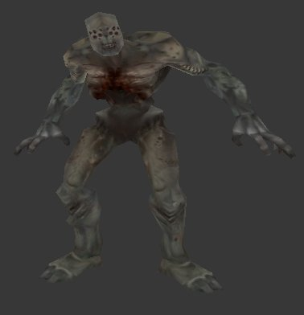



## Doom 3 Model Loader \[With iRender 3D\]

### Description

First on VB! Loading and rendering Doom 3 models with your favourite compiller! It is really possible see the screenshot. This sample uses iRender 3D game engine that is becoming more and more powerfull from day to day. Right industrial quality games and do not spend hours writing boring code! Check it!

P.S. Sorry for missing files, you can dowload it from here: http://irender3d.com/datas/users/1-ireng.zip
 
### More Info
 

             |
---                |---
**Submitted On**   |2005-03-10 11:33:46
**By**             |[iR\_OrBit](https://github.com/Planet-Source-Code/PSCIndex/blob/master/ByAuthor/ir-orbit.md)
**Level**          |Advanced
**User Rating**    |5.0 (20 globes from 4 users)
**Compatibility**  |VB 5\.0, VB 6\.0
**Category**       |[DirectX](https://github.com/Planet-Source-Code/PSCIndex/blob/master/ByCategory/directx__1-44.md)
**World**          |[Visual Basic](https://github.com/Planet-Source-Code/PSCIndex/blob/master/ByWorld/visual-basic.md)
**Archive File**   |[Doom\_3\_Mod1863313102005\.zip](https://github.com/Planet-Source-Code/ir-orbit-doom-3-model-loader-with-irender-3d__1-59410/archive/master.zip)

